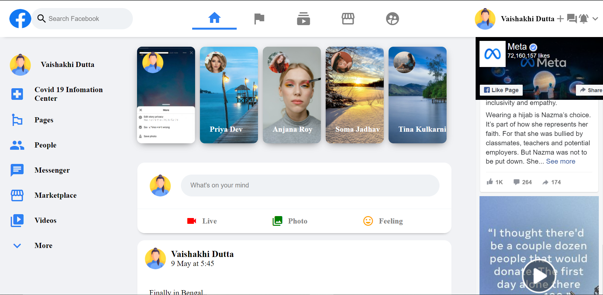

## Overview
 
### Sign-Up Page

#### This page is fully made up of Tailwind-css along with media-queries!

- Sign up Page: (https://github.com/Sonu-Dutta/Facebook-Signup-Page)

### Facebook Clone
 
#### It Consists of Home page of facebook.

### Links

- Solution URL: (https://github.com/Sonu-Dutta/Facebook-Clone)

## My process

### Built with

- Semantic HTML5 markup
- CSS custom properties
- Flexbox
- CSS Grid
- TailwindCss (Sign-up page)
- Mobile-first workflow
- [React](https://reactjs.org/) - JS library
- [Next.js](https://nextjs.org/) - React framework

## Author

- Linkedin - [Sonu-Dutta](https://www.linkedin.com/in/sonu-dutta-6900b3218)
- Twitter - [@sonudutta9999](https://mobile.twitter.com/sonudutta9999)
- Email-(itsmesonudutta@gmail.com)

